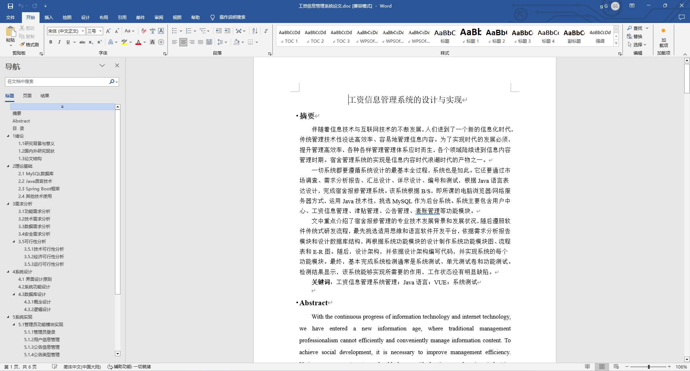
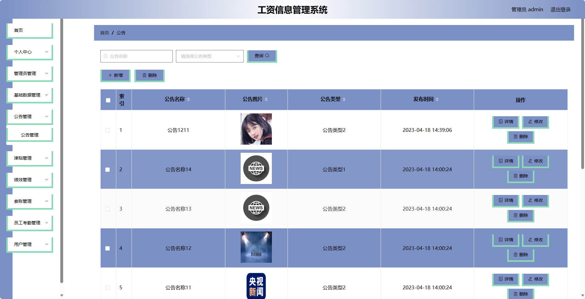
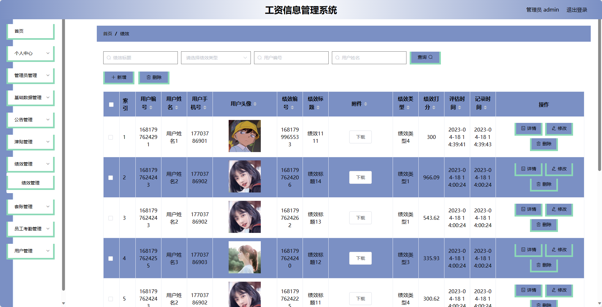
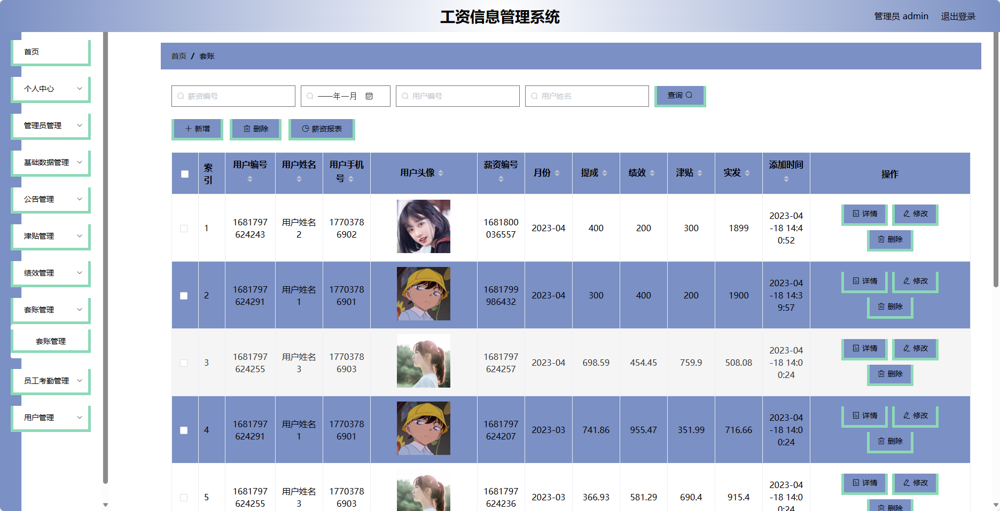
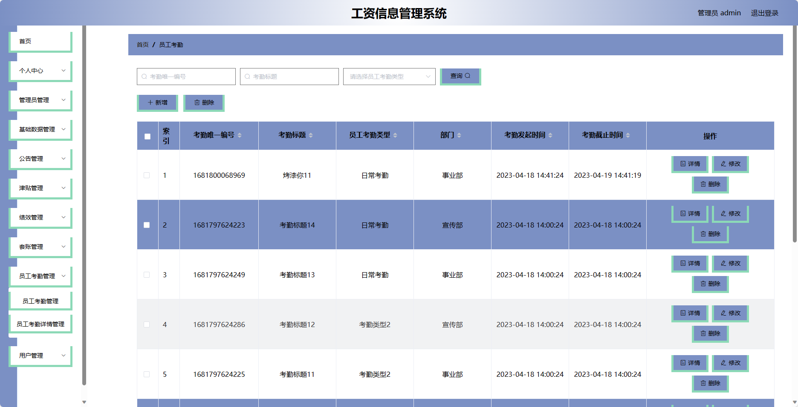
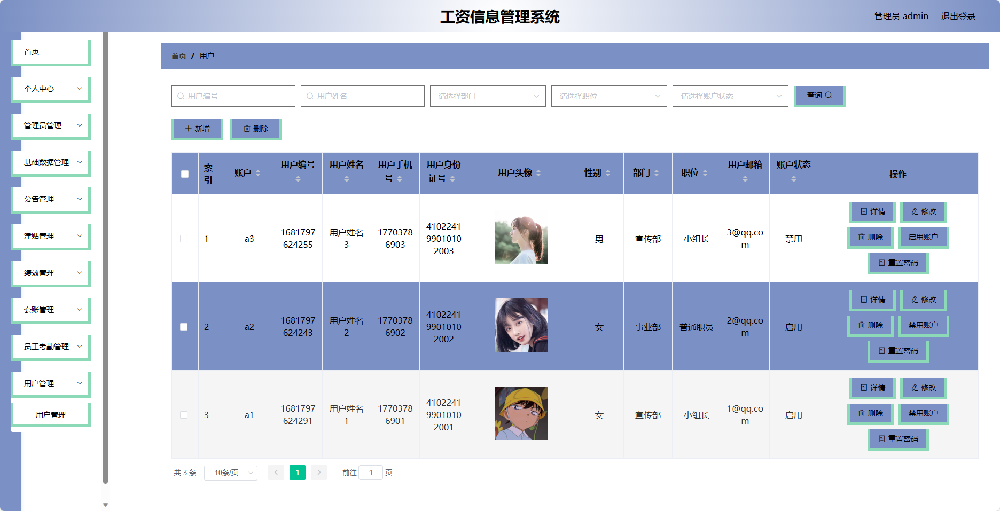
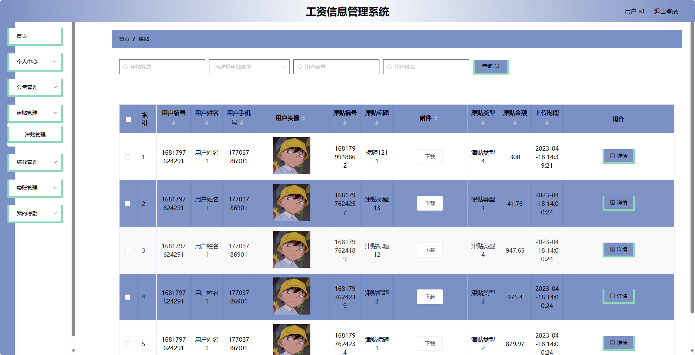
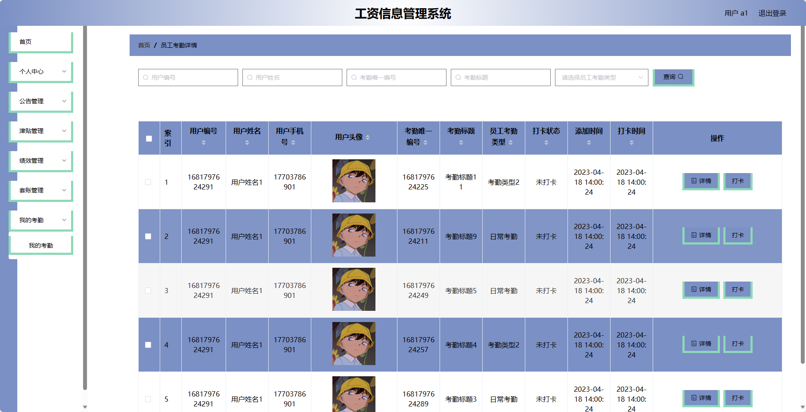

## 基于SpringBoot的工资信息管理系统(程序+报告)

- <b>完整代码获取地址：从戎源码网 ([https://armycodes.com/](https://armycodes.com/))</b>
- <b>技术探讨、资料分享，请加QQ群：692619798</b> 
- <b>作者微信：19941326836  QQ：952045282</b> 
- <b>承接计算机毕业设计、Java毕业设计、Python毕业设计、深度学习、机器学习</b>
- <b>选题+开题报告+任务书+程序定制+安装调试+论文+答辩ppt 一条龙服务</b>
- <b>所有选题地址 ([https://github.com/YuLin-Coder/AllProjectCatalog](https://github.com/YuLin-Coder/AllProjectCatalog)) </b>

## 项目介绍
基于SpringBoot的工资信息管理系统，系统包含两种角色：管理员、用户，主要功能如下。

### 【管理员】:
- 个人中心：管理管理员的个人信息，包括修改密码等操作。
- 管理员管理：管理系统中的管理员账号，包括添加管理员、编辑管理员、删除管理员等操作。
- 基础数据管理：管理系统的基础数据，如部门信息、职位信息等。
- 公告管理：发布和管理公司的公告信息，包括添加公告、编辑公告、删除公告等操作。
- 津贴管理：管理员工的津贴信息，包括查看津贴申请、审批津贴等操作。
- 绩效管理：管理员工的绩效考核情况，包括查看绩效表、评分等操作。
- 套账管理：管理员工的套账信息，包括查看套账表、修改套账等操作。
- 员工考勤管理：管理员工的考勤记录，包括查看考勤表、导入考勤数据等操作。
- 用户管理：管理系统的员工账号，包括添加员工、编辑员工、删除员工等操作。

### 【前台】:
- 个人中心：员工可以管理个人信息，包括修改密码、查看个人工资等操作。
- 公告管理：员工可以查看公司发布的公告信息。
- 津贴管理：员工可以申请津贴，并查看津贴申请的审批状态。
- 绩效管理：员工可以填写绩效考核表，并查看绩效评分结果。
- 套账管理：员工可以查看个人套账信息，如社保、公积金等。
- 我的考勤：员工可以查看自己的考勤记录。

## 项目技术
- 编程语言：Java
- 数据库：MySQL
- 项目管理工具：Maven
- 前端技术：HTML、CSS、JavaScript、Jquery、Vue
- 后端技术：Spring、SpringMVC、MyBatis

## 运行环境
- JDK版本：JDK1.8及以上
- 开发工具：IDEA、Ecplise、Myecplise都可以
- 数据库: MySQL5.7及以上
- Maven：maven3.0及以上
- Node：14.14.0及以上

## 运行截图

